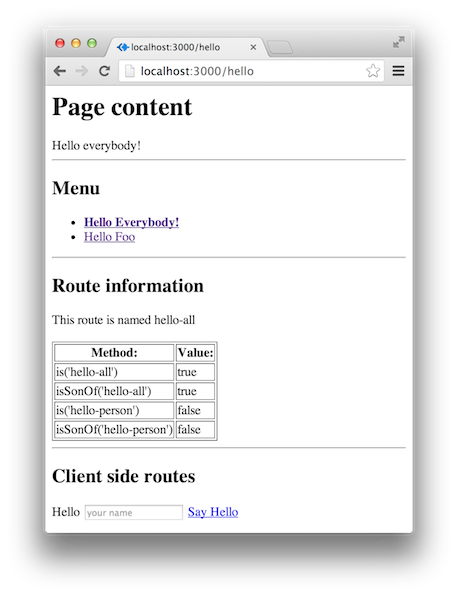
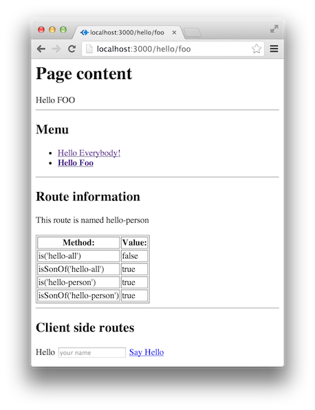
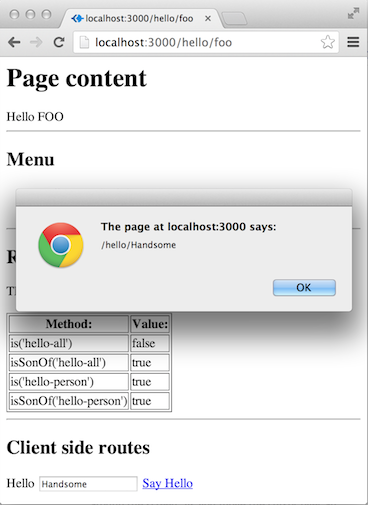

# Menu Example

This example shows you how to create a simple menu using the [Express Shared Routes](https://github.com/hrajchert/express-shared-routes) library and how to share the routes information to the browser for client side rendering.

This assumes that you already read the [Basic Example](1-basic.md).

### What are we doing?
We are going to define two routes

* `/hello`
* `/hello/:name`

The second route being a child of the first one.

When we access `/hello` we are going to see a page that greets everybody, has a menu and some route information.



Notice that in the <b>Route information</b>, we are using the route `hello-all`, which is also 'son' of itself. The functionality
works like the 'instanceof' of classical inheritance.

If we click on the 'Hello Foo' menu link, we will access the page `/hello/foo` which matches with the regexp `/hello/:name`. The link will now be bold, indicating we are at that link.



In the route information we can see that this route is `hello-person` which is son of itself (as discussed before) and a son of `hello-all`. The `isSonOf` method comes handy for other types of navigation components, like [breadcrumb](4-breadcrumb.md).

Also notice that if we access `/hello/Handsome`, the greeting will change, but the menu will indicate 'Hello Foo' is active. This is because the route is `/hello/:name` not `/hello/foo`.

The last thing we'll do is to export the routes to the browser so we can do client side rendering of the links. In this case, if we
fill the input and click 'Say Hello', we'll see an alert box indicating the url needed to greet that person.



### File Structure

This are the files needed to make this example.

* [2-menu.js](../2-menu.js)
* public
   * js
      * routeManager.min.js
* views
   * example2
      * [_route-info.ect](../views/example2/_route-info.ect)
      * [hello-all.ect](../views/example2/hello-all.ect)
      * [hello-person.ect](../views/example2/hello-person.ect)
      * [layout.ect](../views/example2/layout.ect)

Unlike the first example, we are using view templates. The template system I choose was [ECT](http://ectjs.com/). I prefer using syntax closer to `twig` or `jinja` than to `Jade`, and I like it's layout system.

The main file is [2-menu.js](../2-menu.js), in there we setup express, the template system and the routes. The file routeManager.min.js is needed to render client side routes. I copied it from the library repository (will put it in [Bower](http://bower.io/) soon).

Each route has its own view, `/hello` corresponds to [hello-all.ect](../views/example2/hello-all.ect) and `/hello/:name` to [hello-person.ect](../views/example2/hello-person.ect). Both views are using a common [layout.ect](../views/example2/layout.ect), that holds the code for rendering the menu, as well as the client side js needed to render the links in the browser.

### The Code

Make sure you read the [Basic Example](1-basic.md) before diving in here.

#### Route Definition

The first route should not be a surprise by now.

```js
routes.get({name: "hello-all", re: '/hello'}, function(req, res){
    res.render('example2/hello-all.ect');
});
```

We basically say that when the route is `/hello` we should render the [hello-all.ect](../views/example2/hello-all.ect) template, and that we name this route `hello-all`.

The second one shows you another way to create a route, using middleware and a handler inside the definition.

```js
// Example of a middleware that can get stuff from database or in this
// case, modify the request
var getMyData = function(req, res, next) {
    req.msg = req.params.name.toUpperCase();
    next();
};

// This route shows how to call a list of middleware before invoking the handler
routes.get({
    name: "hello-person",
    re: '/:name',
    parent: routes.getRoute('hello-all'),
    mw: [getMyData],
    handler: function(req, res){
        res.render('example2/hello-person.ect',{msg: req.msg});
    }
});
```

This time, the route only receives one parameter, the route. In there we define that this route is son of `hello-all` and we define a list of middleware to execute before calling the final handler.

Note that the handler is passing `req.msg` to the view, and that was created in the middleware


#### Building The Menu (pre-requisites)

In order to create a menu we need to know two things

* Where are we standing: <i>So we can bold the active route</i>
* Where are we going: <i>So we can link between the application</i>

To do the first one, we are going to pass an option to the `RouteManager` constructor

```js
// Creating the route manager
var routes = new RouteManager ({injectToLocals: 'route'});
```

The injectToLocals option is a helper for building a navigation component. It basically inject the <b>active route</b> to `res.locals.<the-name-you-choose>`, in this case `res.locals.route`. This means that if the page is <i>/hello</i>, the view will have a variable called `route` pointing to `hello-all`, and if the page is <i>/hello/foo</i> the `route` variable will point to `hello-person`. Remember we'll need this information to show which is the active route, and make it <b>bold</b>.

For the second requirement, we need to make the <b>RouteManager</b> available to all views, by adding it to `res.locals` for all requests.

```js
// Expose the route manager to the views
app.all('*', function (req,res,next) {
    res.locals.routes = routes;
    next();
});
```

I've could have added the <b>RouteManager</b> instance by configuration as well, but its safer to do it this way, so I don't assume you are always in a matched route. I'm sure that you already have something similar to add the logged in user, flashes and so on, feel free to add it there.

#### Building The Menu

This code is located in the [layout.ect](../views/example2/layout.ect), because its common for all pages.

```rhtml
<h2>Menu</h2>
<ul>
    <li <%- "class='active'" if @route.name == 'hello-all'%>>
        <a href="<%- @routes.getLink 'hello-all' %>">Hello Everybody!</a>
    </li>
    <li <%- "class='active'" if @route.name == 'hello-person'%>>
        <a href="<%- @routes.getLink 'hello-person', {name: 'foo'} %>">Hello Foo</a>
    </li>
</ul>
<hr/>
```

The `href` part is similar to what we've done in the [Basic Example](1-basic.md), but using [Coffescript](http://coffeescript.org/) ([ECT](http://ectjs.com/) uses Coffescript internally). The other part, just adds the class <i>active</i> to the `li` element when the page is the active one. Note that `@route` is the active route, while `@routes` is the <b>RouteManager</b>.


#### Client-side Routes

Finally! Lets put the Shared in [Express Shared Routes](https://github.com/hrajchert/express-shared-routes).

So, if you are trying to do something like a [SPA](http://en.wikipedia.org/wiki/Single-page_application), or you are just trying to re-render a template that has some links in it, you'll need to have the routes in the browser as well. Don't worry, we have you covered.

In this simple example we are not doing a SPA nor re-rendering a template, cause that would probably need other technologies (I use [Backbone](http://backbonejs.org/) in particular). What we are doing, is creating a dynamic link from the user input.

The browser code to do so can be found in the [layout.ect](../views/example2/layout.ect) and looks like this

```rhtml
<script src="/js/routeManager.min.js"></script>
<script type="text/javascript">
// Create the routes from the browser route manager. You need to provide the exported routes!
var routes = new RouteManager(<%- JSON.stringify(@routes.exportRoutes()) %>);
window.onload = function() {
    // Handle the say hello onclick event
    var sayHelloButton = document.getElementById("sayHello");
    sayHelloButton.onclick = function() {
        // Get the name of the person to say hello to
        var inputName = document.getElementById("person_name").value;
        // Display the link to say hello!
        alert(routes.getLink('hello-person',{name: inputName}));
        return false;
    }
}
</script>
```

First, we need to include the client side <b>RouteManager</b>. In this case we add it directly, but if you use [RequireJS](http://requirejs.org/) you can check on the [third example](3-menu-requirejs.md).

Once we have it, we create the client side <b>RouteManager</b> from the exported routes. Notice how we are using `<%- JSON.stringify ... `. In the future, we may add an option to get them via an AJAX request, so we don't pollute the html.

Then its easy as pie, we just call `routes.getLink('hello-person',{name: inputName})` as we are used to :D (and some code get the value from the input).

Hope you enjoyed it!


